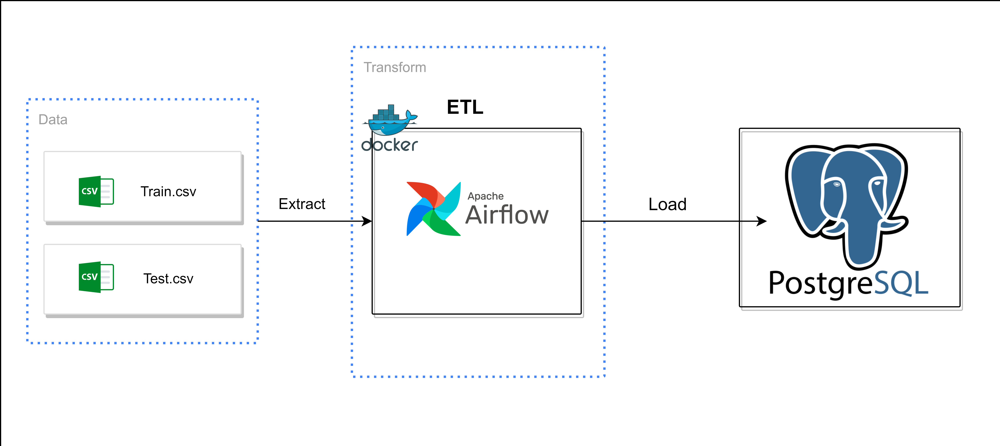
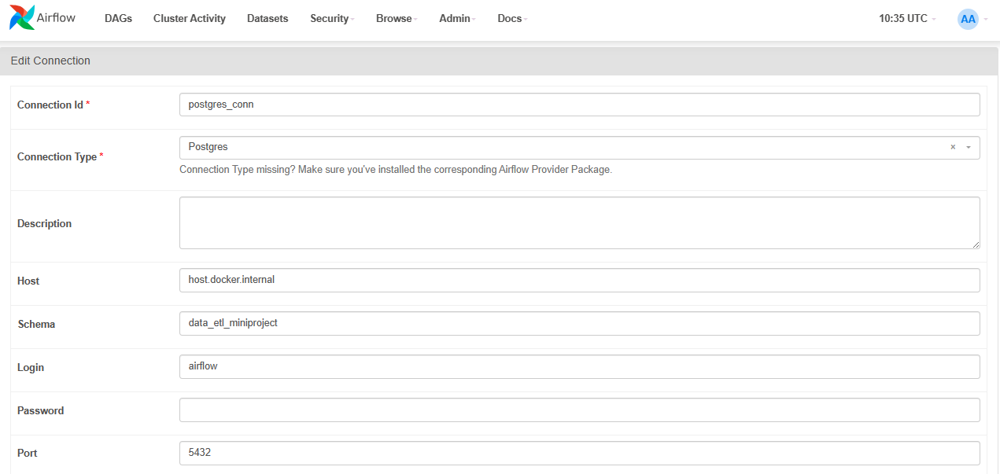
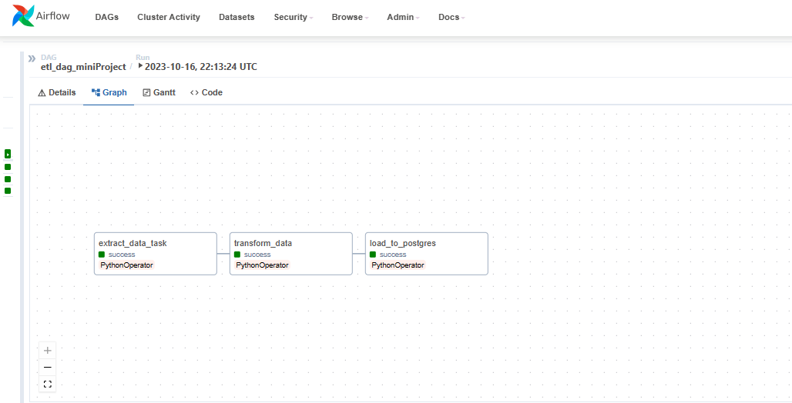
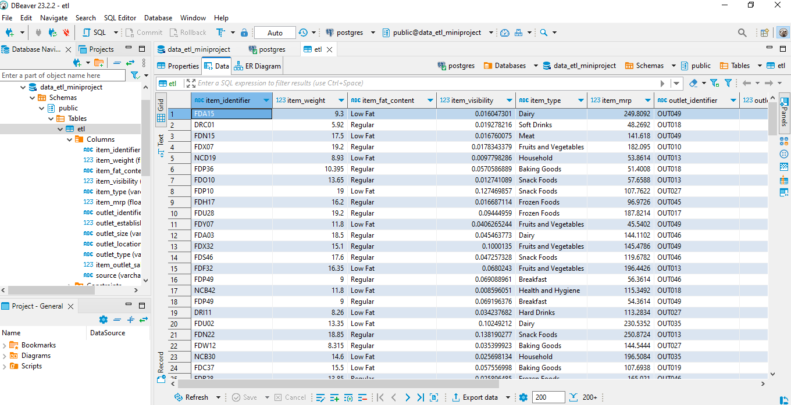

# ETL_Sales_Data
## Project Overview
This repository contains a mini project demonstrating an ETL (Extract, Transform, Load) pipeline for processing sales data using Docker and Apache Airflow for orchestration.
## Prerequisites
- Docker and Docker Compose installed
- Python 3.x
- Apache Airflow: Set up Apache Airflow, and ensure it's running in a Docker container
- Postgresql (you can use [pgAdmin4](https://www.pgadmin.org/) or [DBeaver](https://dbeaver.io/) )
## Data Pipeline



## Database Setup and Connection
### Creating the PostgreSQL Table
1. Make sure you have PostgreSQL installed and running.
2. Use your preferred database management tool (e.g., pgAdmin4 or DBeaver) to create a new database for this project and set Airflow as the owner.
3. Connect to your PostgreSQL instance and execute this SQL script to create the table 

```sql
-- SQL script to create the sales_data table
   CREATE TABLE etl( Item_Identifier character varying(45) NOT NULL , 
                      Item_Weight FLOAT NOT NULL , 
                      Item_Fat_Content character varying(45) NOT NULL,
                      Item_Visibility FLOAT NOT NULL , Item_Type character varying(45) NOT NULL, 
                      Item_MRP FLOAT NOT NULL ,
                      Outlet_Identifier character varying(45) NOT NULL,
                      Outlet_Establishment_Year INTEGER NOT NULL, 
                      Outlet_Size character varying(45) NOT NULL, 
                      Outlet_Location_Type character varying(45) NOT NULL,
                      Outlet_Type character varying(45) NOT NULL, 
                      Item_Outlet_Sale FLOAT NOT NULL, 
                      source character varying(45) NOT NULL
);
```
### Configuring Airflow
1. Open the Airflow web UI.
2. Go to the "Admin" section and select "Connections."
3. Click "Create" to add a new connection.
4. Set the connection type to "PostgreSQL."
5. Fill in the required connection details (host, port, schema, login, password).



Once the PostgreSQL connection is properly configured, you can trigger the Airflow DAG, and it will smoothly commence the ETL process.



Following this, you will find the data successfully uploaded to your PostgreSQL database.



## Repository Structure
In this structure:
- `/docker-compose` contains the Docker Compose file for defining and running the Docker containers.
- `/etl_script` contains the Python script for the ETL pipeline (`pipeline.py`).
- `/data` contains the input data files (`Train.csv` and `Test.csv`).
- `Dockerfile` specifies how to build the Docker image for the ETL pipeline.
- `requirements.txt` lists the Python dependencies needed to run the ETL pipeline.
- `README.md` provides information about the project and how to set it up.


